# Caitlin Achemedei - Portfolio Task

​
Link to my portfolio site: https://cachemedei.github.io/
​

## Project Requirements

This portfolio website includes:

### Content
- A 'header' section with a navigation bar to different pages of the site. 
- A 'hero' section with a short bio and photo of myself. 
- An 'articles' section describing myself in further detail and a link to my GitHub profile to look at my projects.
- A functional contact form created using Formspree
- A footer with the GitHub and LinkedIn logos that link to their external respective sites.
​
### Technical
- 3 web pages: a homepage, contact page and a gallery page.
- The creation of this portfolio website was consistently version controlled with Git.
- It has been deployed on GitHub Pages.
- Implements responsive design principles
- Uses semantic HTML
- Has been written to be as accessible as possible with regards to assistive technology

### Features

​- When hovering over any links, buttons and article info cards I added some CSS Styles to lighten or darken the color of the element to bring focus to it

### Screenshots

#### Homepage: Desktop

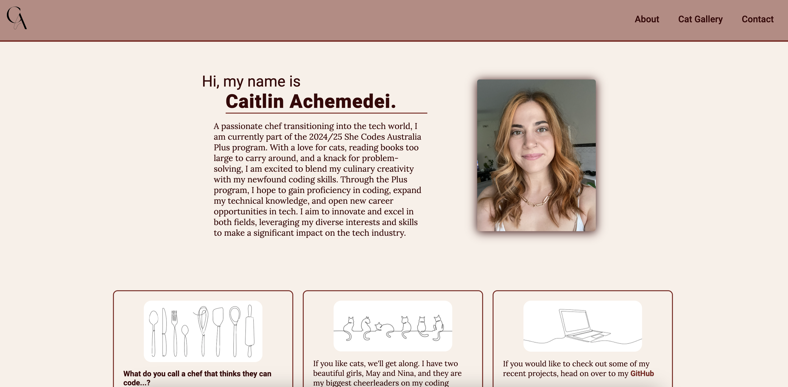

#### Homepage: Desktop - articles section showing a hover state
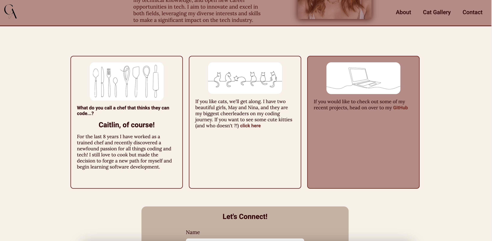

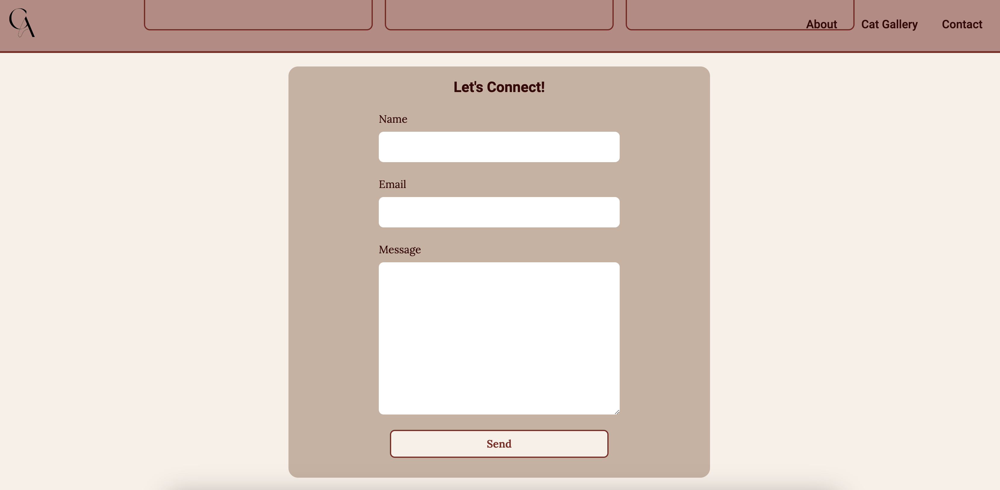

#### Homepage: Mobile
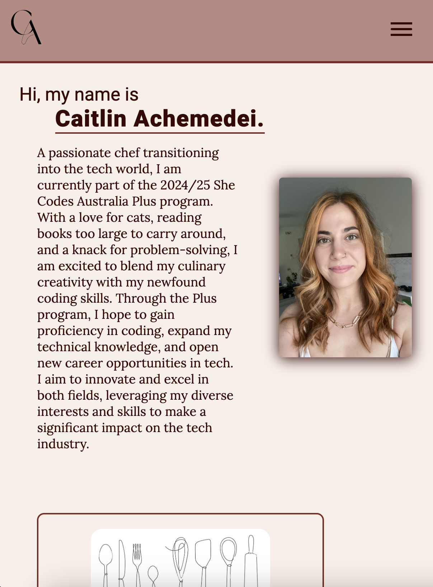

#### Homepage: Mobile - mobile nav menu displayed
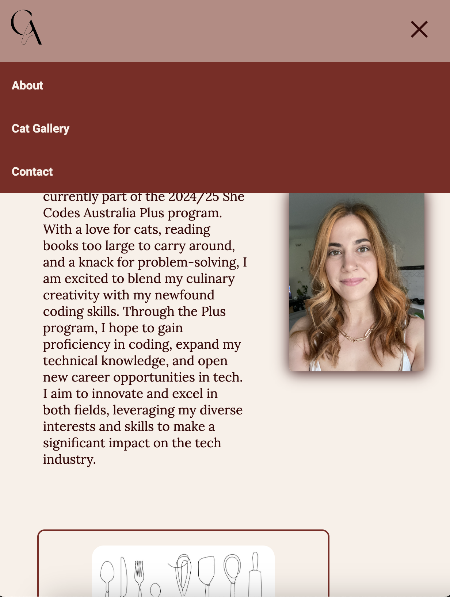

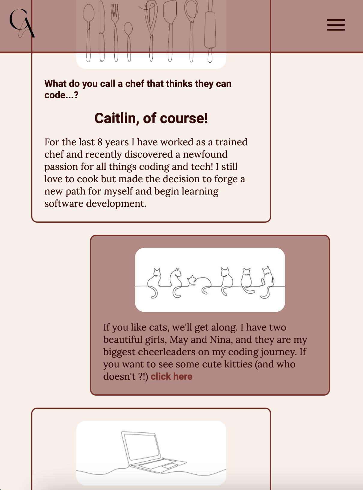

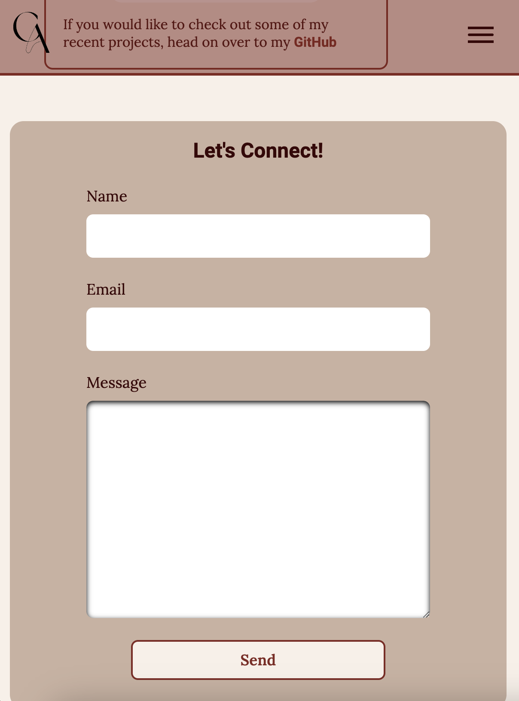

#### Contact Page: Mobile + Desktop
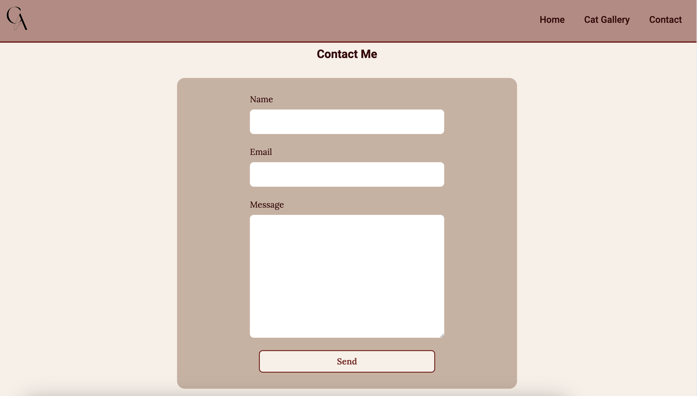

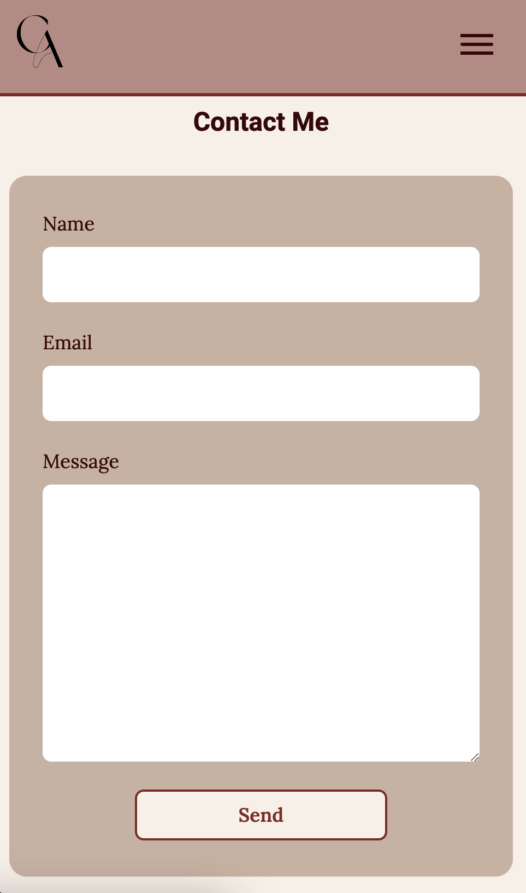

#### Gallery Page: Mobile + Desktop
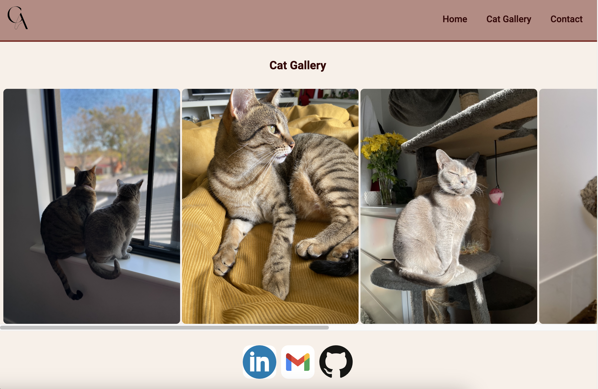

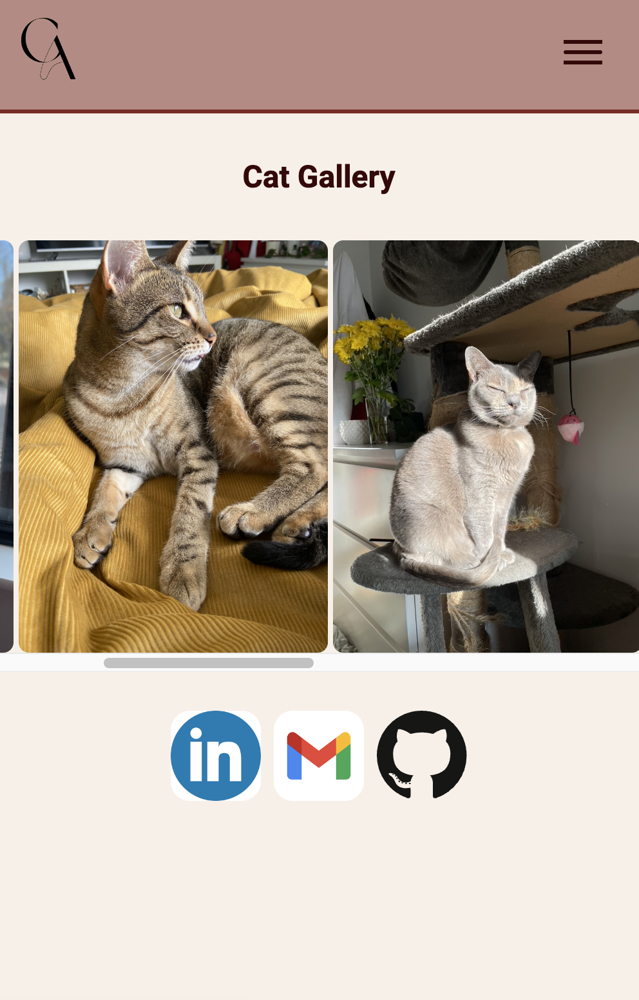
